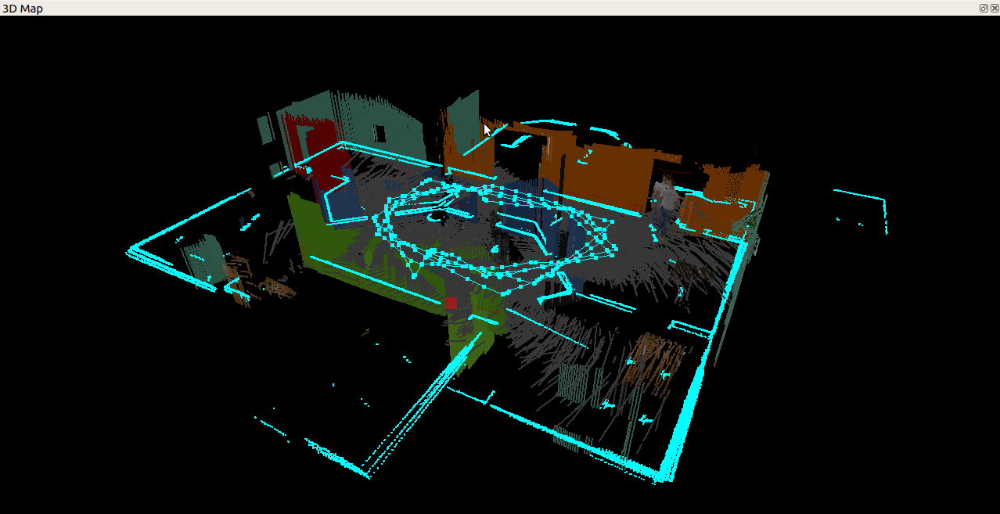
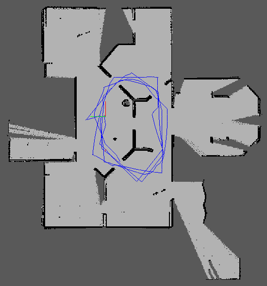
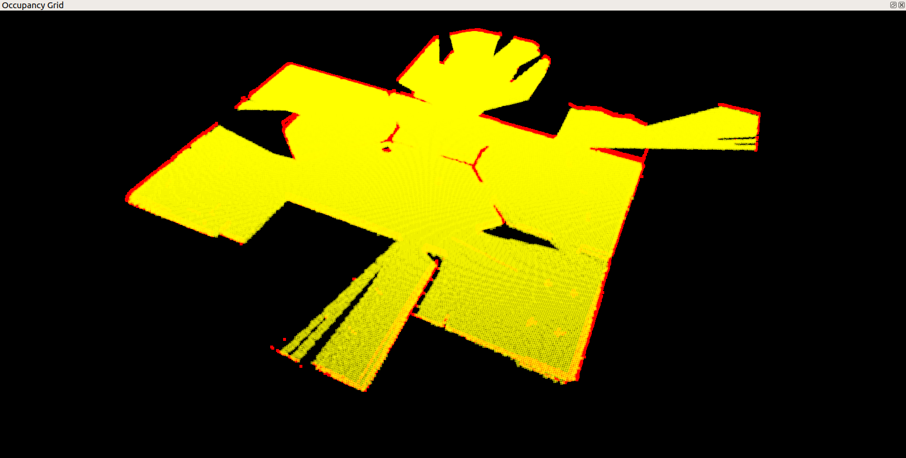
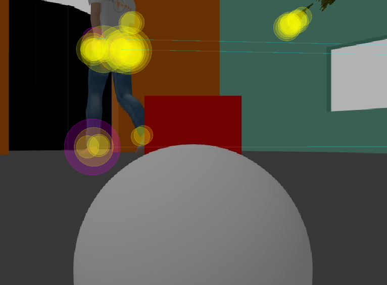

# Project 4: Map My World

An application of [rtabmap-ros](http://wiki.ros.org/rtabmap_ros) package for 
simultaneous localization and mapping (SLAM) of a mobile robot. 
This project is part of Udacity Robotics Software Engineer Nanodegree.

<table style="width:100%">
  <tr>
    <th><p>
           </a>
           <br>3D Map
        </p>
    </th>
    <th><p>
           </a>
           <br>2D Map
      </p>
    </th>
  </tr>
  <tr>
    <th><p>
           </a>
           <br>Occupancy Grid
      </p>
    </th>
    <th><p>
           </a>
           <br>Detected features
      </p>
    </th>
  </tr>
</table>

## Description
The project consists of the following parts:
1. A Gazebo world and a mobile robot from this [project](https://github.com/huuanhhuynguyen/RoboND-Go-Chase-It).
2. ROS package: [rtabmap-ros](http://wiki.ros.org/rtabmap_ros)

## Prequisites
1. ROS (Melodic or Kinetic), Gazebo on Linux
2. CMake & g++

## Setup, Build and Launch
1. Install Gazebo and ROS(melodic/kinetic) on Linux.

2. Initialize a catkin workspace
```
$ mkdir -p catkin_ws/src
$ cd catkin_ws/src
$ catkin_init_workspace
```

3. Within `catkin_ws/src`, clone the project
```
$ git clone https://github.com/huuanhhuynguyen/RoboND-Map-My-World.git
$ cp -R RoboND-Map-My-World/my_robot .
$ cp -R RoboND-Map-My-World/rtabmap.db .
$ cp -R RoboND-Map-My-World/default.rviz .
$ rm -rf RoboND-Map-My-World
```

4. Also within `catkin_ws/src`, clone the `teleop` project
```
$ git clone https://github.com/ros-teleop/teleop_twist_keyboard
```

5. Install ROS packages required for this project
```
$ sudo apt-get install ros-${ROS_DISTRO}-rtabmap-ros
```

6. Move back to `catkin_ws\` and build
```
$ cd ..
$ catkin_make
```

7. Launch the world and robot
```
$ source devel/setup.bash
$ roslaunch my_robot world.launch
```

8. Open another terminal (Ctrl+Shift+T), and launch the `mapping.launch` file. 
Here, the rtabmap-ros package will be launched.
```
$ source devel/setup.bash
$ roslaunch my_robot mapping.launch
```

9. Open another terminal, and run the `teleop` node.
```
$ source devel/setup.bash
$ rosrun teleop_twist_keyboard teleop_twist_keyboard.py
```

10. Click on this terminal, type keyboard to navigate the robot around. Navigate 
the robot to scan its surrounding environment. The rtabmap-ros package will save
the resulted map with the localized trajectory of the robot in a database file 
`~/.ros/rtabmap.db`.

11. Open another terminal, and open up the database file using `rtabmap-databaseViewer`
```
$ rtabmap-databaseViewer ~/.ros/rtabmap.db
```
    a. Choose View -> Constraints View and Graph View
    b. To see 3D Map, Choose Edit -> View 3D Map ...
    
You could also open the database I already generated in this project.
